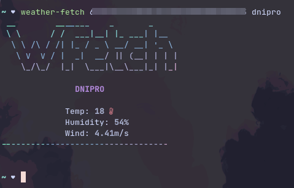

# WFetch

# INSTALL
* **Dependencie** _[npm](https://www.npmjs.com/)_  
```
$ npm i -g weather-fetch
```
# USAGE
```
$ weather-fetch [city]
```
* **Weather-fetch use openweathermap, in [city] should be city name**
## EXAMPLE 
```
$ weather-fetch dnipro

$ weather-fetch London, GB
```

